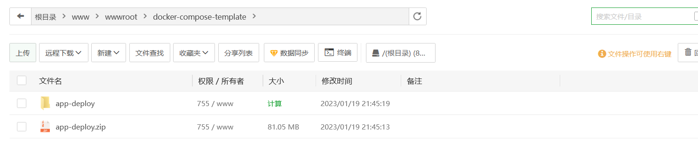

## 一键部署若以项目

### 介绍

​		在刚刚接触ruoyi框架的时候, 像我这样的新手一般喜欢先部署上服务器, 本项目就是专门快熟部署ruoyi项目的, 而且自动重写部分配置, 端口号以及文件上传路径, 和已经配置好的 nginx 这样就可以专注于开发和学习.

### 快速了解

​		这是一个专门为ruoyi定制的部署脚本, 把麻烦(复杂的配置过程)抽离出来, 做最少的配置来部署ruoyi项目, 让维护变的简单.

### 系统需求

docker

docker-compose

Linux

### 内置功能

1. start.sh 一键部署容器, 第一次部署完后只需要替换ruoyi-admin.jar(后端服务程序)文件和./app/html(前端静态文件)后再次启动start.sh就可以再次完成部署, 一般启动时间为几秒
2. stop.sh 停止容器并删除, 但是会保留数据

## 配置

​		配置`.env`来完成项目的配置

## 演示

​		此次项目演示通过https://gitee.com/Ning310975876/ruo-yi-vue-blog.git项目来完成.

### 1. 首先我们先pull下来该项目

### 2. 接着使用idea打开(方便), 使用maven打包

按上面的红框框依次点击, 因为是多模块项目在打包先要先把其他依赖模块打包到maven

### 3. 拷贝后端程序和sql文件

我们在ruoyi-admin模块的target目录下找到后端服务程序 `ruoyi-admin.jar` 把次服务程序复制到 ./app 下面, 在把项目的 `初始化sql文件` 拷贝到/app目录下

### 4. 打包 前端静态资源 

### 5. 把打包完后的静态资源拷贝到 `/app/html` 目录下

最后的样子长这样, 红框的几个是不能删的. 字体文件是为了修复ruoyi验证码的bug

### 6. 最后把整个文件压缩上传的服务器上, 解压缩

### 7. 运行

## 结语

​		如果有问题和想法随便提随便骂, 本人是大专生所以不用估计面子. 欢迎 `issue` 和 `PR` .